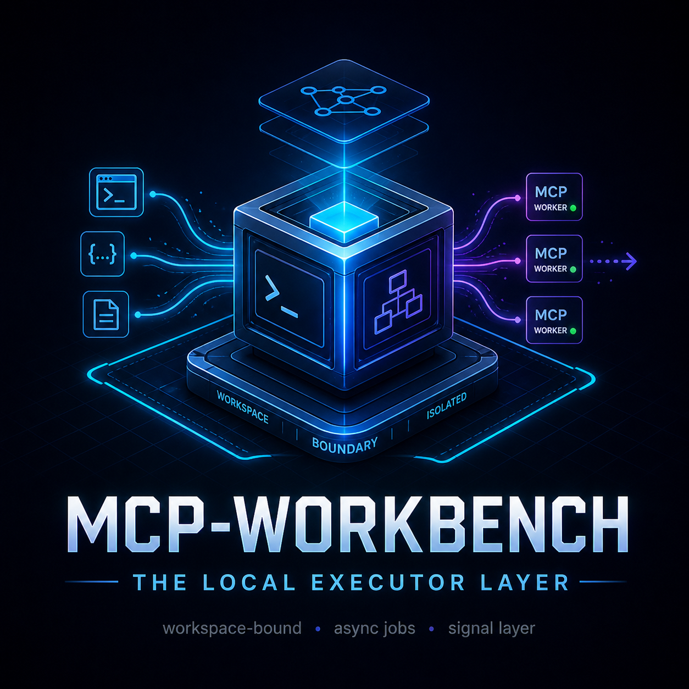
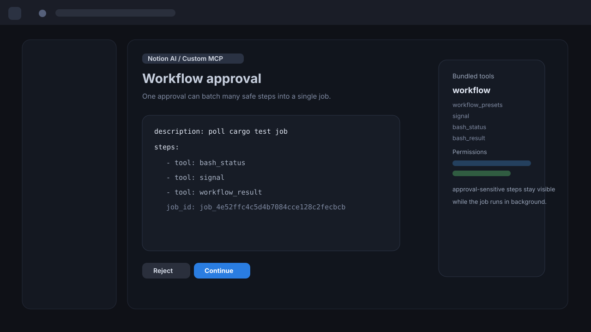
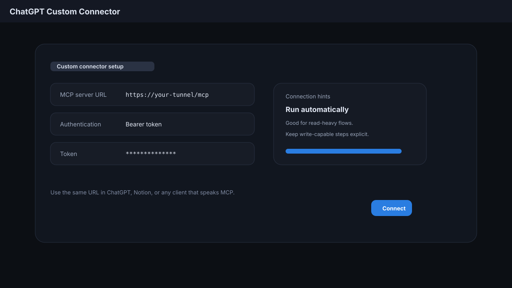
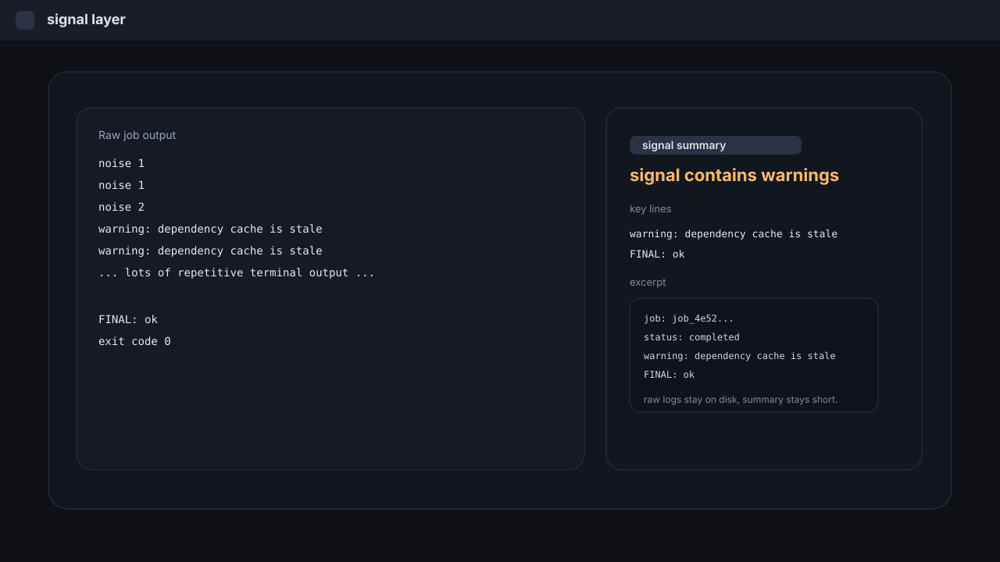

# mcp-workbench

<p align="center">
  
</p>

<p align="center"><strong>Self-hosted MCP worker factory for ChatGPT, Notion, and local agent workflows.</strong></p>

<p align="center">
  <code>self-hosted</code>
  <code>workspace-bound</code>
  <code>async jobs</code>
  <code>signal layer</code>
  <code>multi-worker</code>
</p>

<blockquote>
A local MCP execution layer for power users who want repeatable workers, clear workspace boundaries, and condensed job output without rebuilding the stack each time.
</blockquote>

Public template for a self-hosted MCP worker behind Cloudflare Tunnel.

This repo is meant to be cloned, configured with your own workspace, and then pointed at your own `cloudflared` instance.

It ships with a bundled MCP server layer by default, plus an optional override if you want to run an external backend instead.

## Table of contents

- [Security warning](#security-warning)
- [How it works](#how-it-works)
- [Architecture](#architecture)
- [Screenshots](#screenshots)
- [What you get](#what-you-get)
- [Use cases](#use-cases)
- [Why `mcp-workbench`](#why-mcp-workbench)
- [Requirements](#requirements)
- [Quick start](#quick-start)
- [Dashboard](#dashboard)
- [Agent-first setup](#agent-first-setup)
- [Config validation](#config-validation)
- [Smoke test](#smoke-test)
- [Configuration](#configuration)

## Security warning

This worker can read files, write files, and run shell commands inside the workspace you expose.

- Set `MCP_TOKEN` before exposing it through a public tunnel.
- Keep `WORKSPACE_DIR` narrow.
- Do not point it at your home directory unless you understand the risk.
- Quick tunnels are for development and testing, not long-lived production use.

## How it works

1. By default, the bundled MCP server layer starts on your local machine.
2. If you set `MCP_SERVER_CMD`, the launcher uses that external command instead.
3. The tunnel exposes the local server through a public URL.
4. ChatGPT, Notion, or another MCP client connects to that URL.
5. The tools you see come from the bundled server layer or from the external backend you selected.

## Architecture

```text
ChatGPT / Notion / other client
            |
     Cloudflare Tunnel
            |
    Local MCP server on 127.0.0.1
      /                       \
bundled server layer      external backend
            |
        WORKSPACE_DIR
```

## Screenshots

These example visuals show the main flows the repo is built around.

<table>
  <tr>
    <td align="center">
      
      <br />
      <sub>Notion workflow approval and batched steps.</sub>
    </td>
    <td align="center">
      
      <br />
      <sub>ChatGPT custom connector setup.</sub>
    </td>
  </tr>
  <tr>
    <td align="center" colspan="2">
      
      <br />
      <sub>Signal layer distilling noisy job output.</sub>
    </td>
  </tr>
</table>

## What you get

- A bundled MCP server layer with common coding tools and async workflow jobs
- A minimal `bash` launcher for a local MCP server
- A tunnel launcher for quick or named Cloudflare tunnels
- Systemd user unit examples
- A local dashboard for worker status, connector URLs, and job signals
- A config validator for worker profiles, workflow presets, and signal filters
- A single `.env` template with the knobs you usually need
- Clear separation between the launcher, the tunnel, and the actual MCP backend

## Use cases

- Build a self-hosted execution layer that feels closer to a coding agent than a plain chat assistant
- Use ChatGPT or Notion as the front-end while MCP handles local filesystem access, shell commands, and workflow orchestration
- Prototype a Codex or Claude Code style loop with your own workspace boundaries, policies, and tools
- Reuse the same backend across different clients, projects, or environments without rewriting the server each time
- Publish a demoable endpoint for a team, a sandbox, or a personal workspace
- Keep approval-sensitive tools, read-only tools, and workflow wrappers organized in one place
- Experiment with agentic coding workflows using the models and UI already available in your client

## Why `mcp-workbench`

- It is broad enough to fit multiple clients and server implementations
- It reads like a reusable template, not a one-off personal script bundle
- It signals a place to experiment, iterate, and keep the setup organized
- It stays neutral if you later add Notion, ChatGPT, Claude, or other MCP clients
- It works as a public GitHub repo name and as a local project folder name
- It suggests a workspace for MCP experiments, not a locked-in product
- It leaves room for future presets, wrappers, and deployment profiles

## Requirements

- `bash`
- `node 20+`
- `cloudflared` or `docker`
- only if you override the bundled server: whatever your external MCP backend needs to run

## Quick start

1. Copy the example env file:

   ```bash
   cp .env.example .env
   ```

2. Configure the workspace.

   Edit `.env`.

   Leave `MCP_SERVER_CMD` empty to use the bundled server layer.

   If you want to swap in an external backend, set `MCP_SERVER_CMD` to that command.

   At minimum, set:

   - `WORKSPACE_DIR`
   - `MCP_TOKEN` or `MCP_ALLOW_NO_AUTH=1` for local development only
   - `MCP_PORT` only if you want a different local port

   Recommended:

   - `MCP_ALLOW_OUTSIDE_WORKSPACE=0`
   - `MCP_ALLOW_QUERY_TOKEN=0`
   - `MCP_ENABLE_WRITE_TOOLS=0`
   - `MCP_ENABLE_BASH=0`
   - `MCP_ENABLE_WEBFETCH=0`
   - `TUNNEL_MODE=quick` for testing

3. Start the worker.

   Start the server and tunnel together:

   ```bash
   ./scripts/up.sh
   ```

   Before you connect the client, run:

   ```bash
   make doctor
   make smoke-test
   ```

4. Copy the tunnel URL.

   Copy the printed `trycloudflare.com` URL into your MCP client.

   If your client asks for a path, use the same tunnel URL plus `/mcp`.

5. Connect the client.

   Add the URL to ChatGPT or Notion.

   If you use Notion workspace URL restrictions, add the tunnel URL to the allowlist first.

   For auth:

   - use `Bearer <MCP_TOKEN>` when the client supports bearer auth
   - or use `?auth_token=<MCP_TOKEN>` only if you intentionally set `MCP_ALLOW_QUERY_TOKEN=1`
   - if you want no auth at all, set `MCP_ALLOW_NO_AUTH=1` for local development only

6. Use the tools.

   Talk to the client normally.

   - For codebase work, use `read`, `grep`, `codesearch`, `edit`, `write`, `apply_patch`, and `bash`
   - For long jobs, use `bash` plus `bash_status` / `bash_result`
   - For multiple steps in one approval, use `workflow`
   - For condensed noisy output, use `signal`

7. Optional: install as a user service.

   If you want the worker to start with your session:

   ```bash
   ./scripts/install-systemd.sh
   systemctl --user daemon-reload
   systemctl --user enable --now mcp-workbench.service mcp-workbench-tunnel.service
   ```

## Dashboard

After you start the worker, open the local dashboard in your browser:

```text
http://127.0.0.1:3333/dashboard
```

If your `MCP_PORT` is different, replace `3333` with that port.

You can also open it with:

```bash
make dashboard
```

The dashboard shows:

- worker profiles and permission badges
- `Public connector URL` for ChatGPT / Notion
- `Local MCP URL` for localhost debugging only
- auth hints and copy buttons
- workspace and runtime info for the selected worker
- local-only controls for create/start/stop/restart actions
- job timeline
- selected job signal summary
- quick tunnel or named tunnel notes
- `workspace_info` details for the active worker boundary and runtime

This `mcp-workbench dashboard` is the quickest way to inspect worker state without reading env files by hand.

To create a new worker from the dashboard:

1. Fill `Worker name`, `Client`, `Workspace`, `Permission`, and `Port`.
2. Click `Create worker`.
3. Click `Start server`.
4. Click `Start tunnel`.
5. Copy `Public connector URL` into ChatGPT or Notion.
6. Copy auth if the worker uses bearer auth.

Use `Local MCP URL` only when you are debugging on the same machine.

The same dashboard also works for a selected worker profile when you pass `?worker=<name>` or `?job=<jobId>` in the URL.

## Config validation

Before you connect a client, run the validator against worker profiles, workflow presets, and signal filters:

```bash
make validate-config
```

Use this when you edit `worker-profiles/`, `workflow-presets/`, or `signal-filters/`. It catches malformed declarative config before you start a worker.

## Agent-first setup

If you want multiple workers, let a local coding agent create them for you instead of editing a single `.env` by hand.

Example prompt:

```text
buatin 2 worker, 1 untuk chatgpt, satu untuk notion. permission nya keduanya YOLO dan workdir di Documents/project
```

The agent should follow [AGENTS.md](AGENTS.md) and generate one env file per worker under `.mcp-workbench/workers/`.
The built-in permission presets are `readonly`, `standard`, and `yolo`; `yolo` still keeps the workspace boundary enforced.
You can also start from `worker-profiles/dual-chatgpt-notion.yaml` and edit the workspace path if needed before generating both workers in one shot.

Suggested commands:

```bash
node ./scripts/generate-worker.mjs --profile worker-profiles/dual-chatgpt-notion.yaml
node ./scripts/generate-worker.mjs --name chatgpt --client chatgpt --workspace ~/Documents/project --permission yolo --port 3333
node ./scripts/generate-worker.mjs --name notion --client notion --workspace ~/Documents/project --permission yolo --port 3334
./scripts/worker-list.sh
./scripts/worker-doctor.sh chatgpt
./scripts/worker-doctor.sh notion
./scripts/worker-up.sh chatgpt
./scripts/worker-up.sh notion
```

If you prefer `make`:

```bash
make worker-generate ARGS='--name chatgpt --client chatgpt --workspace ~/Documents/project --permission yolo --port 3333'
make worker-up WORKER=chatgpt
make worker-doctor WORKER=chatgpt
make worker-install-systemd WORKER=chatgpt
```

For a persistent setup, install per-worker systemd units:

```bash
./scripts/worker-install-systemd.sh chatgpt
./scripts/worker-install-systemd.sh notion
systemctl --user daemon-reload
systemctl --user enable --now mcp-workbench-chatgpt.service mcp-workbench-chatgpt-tunnel.service
systemctl --user enable --now mcp-workbench-notion.service mcp-workbench-notion-tunnel.service
```

## Smoke test

Run the bundled end-to-end check before you point a client at the worker:

```bash
make smoke-test
```

If you do not use `make`, run:

```bash
node ./scripts/smoke-test.mjs
```

For a broader local check before commit or release, run:

```bash
make verify
```

For config and profile validation only, run:

```bash
make validate-config
```

## Configuration

| Variable | Purpose | Default |
| --- | --- | --- |
| `WORKSPACE_DIR` | Workspace root exposed to file tools | repo root |
| `MCP_TOKEN` | Auth token for tunnel/client access | `change-me` |
| `MCP_ALLOW_NO_AUTH` | Allow local dev without auth | `0` |
| `MCP_ALLOW_QUERY_TOKEN` | Allow `?auth_token=...` fallback | `0` |
| `MCP_ALLOW_OUTSIDE_WORKSPACE` | Allow file tools outside `WORKSPACE_DIR` | `0` |
| `MCP_SERVER_CMD` | Optional external MCP backend command | empty |
| `MCP_HOST` | Local bind host | `127.0.0.1` |
| `MCP_PORT` | Local server port | `3333` |
| `MCP_ENABLE_WRITE_TOOLS` | Expose `write`, `edit`, `apply_patch` | `0` |
| `MCP_ENABLE_BASH` | Expose `bash` and bash job tools | `0` |
| `MCP_SANITIZE_BASH_ENV` | Strip risky environment variables from `bash` jobs | `1` |
| `MCP_ENABLE_WEBFETCH` | Expose `webfetch` | `0` |
| `MCP_ENABLE_WORKFLOW` | Expose `workflow` and workflow cancel | `1` |
| `MCP_RESPONSE_MODE` | `auto`, `json`, or `sse` response mode | `auto` |
| `MCP_MAX_BODY_BYTES` | Maximum JSON-RPC request body size | `1048576` |
| `MCP_ALLOWED_ORIGINS` | CORS allowlist | `*` |
| `MCP_WORKFLOW_MODE` | Workflow mode hint for your runtime | `sync` |
| `MCP_WORKFLOW_JOB_DIR` | Job storage directory | `.mcp-workbench/jobs` |
| `MCP_WORKFLOW_PRESET_DIR` | Declarative workflow presets directory | `workflow-presets` |
| `MCP_SIGNAL_FILTER_DIR` | Workspace-local signal filters directory | `.mcp-workbench/signal-filters` |
| `MCP_SIGNAL_TRUST_REGISTRY` | Trusted workspace filter registry path | `~/.config/mcp-workbench/trusted-workspaces.json` |
| `MCP_WORKFLOW_POLL_INTERVAL_MS` | Poll interval for async jobs | `1000` |
| `MCP_JOB_RETENTION_HOURS` | Cleanup age for finished jobs | `24` |
| `MCP_JOB_MAX_COUNT` | Maximum retained finished jobs | `200` |
| `MCP_JOB_CLEANUP_INTERVAL_MS` | Cleanup interval in milliseconds | `3600000` |
| `TUNNEL_MODE` | `quick` or `named` | `quick` |
| `TUNNEL_URL` | Local upstream target for quick tunnel | `http://127.0.0.1:3333` |
| `CLOUDFLARED_EDGE_IP_VERSION` | Cloudflared edge IP version | `auto` |
| `CLOUDFLARED_IMAGE` | Docker image for quick tunnel fallback | `cloudflare/cloudflared:latest` |
| `CLOUDFLARED_CONFIG` | Named tunnel config path | `cloudflared/config.yml` |
| `MCP_STARTUP_TIMEOUT` | Wait time for the local server | `60` |

## Bundled server layer

The bundled server layer exposes the common tools directly. High-risk tools are gated by env and may be hidden from `tools/list` until you enable them:

- `read`
- `write`
- `edit`
- `glob`
- `grep`
- `codesearch`
- `lsp`
- `apply_patch`
- `bash`
- `bash_status`
- `bash_tail`
- `bash_result`
- `bash_kill`
- `webfetch`
- `job_retrieve`
- `signal_diff`
- `signal_filters`
- `trust_workspace_filters`
- `workflow`
- `workflow_presets`
- `signal`
- `workflow_status`
- `workflow_result`
- `workflow_cancel`

It is the default when `MCP_SERVER_CMD` is empty.

### Tool groups and risk

| Group | Tools | Risk |
| --- | --- | --- |
| Read-only | `read`, `glob`, `grep`, `codesearch`, `lsp`, `job_retrieve`, `signal_diff`, `signal_filters` | lower |
| Network | `webfetch` | medium |
| Write | `write`, `edit`, `apply_patch` | high |
| Execution | `bash`, `bash_status`, `bash_tail`, `bash_result`, `bash_kill` | very high |
| Workflow | `workflow`, `workflow_status`, `workflow_result`, `workflow_cancel` | depends on steps |
| Presets | `workflow_presets` | lower |
| Settings | `trust_workspace_filters` | low |
| Signal | `signal` | lower |

## Tool semantics

- `codesearch` is grep-like workspace search, not a full indexed code database.
- `lsp` is best-effort text matching for symbols, not a full language server.
- `workflow` is a job wrapper that can run inline steps or a named preset.
- `bash` returns a `job_id` immediately and should be followed by `bash_status`, `bash_tail`, or `bash_result`.
- `workflow_presets` lists preset files from `MCP_WORKFLOW_PRESET_DIR` and can inspect a named preset.
- `signal` is the built-in signal layer in this repo: it distills noisy job output into a compact summary, adds rewind refs, and keeps raw logs on disk.
- `job_retrieve` reads raw job output again from a `rewind:...` ref when you need the uncompressed log.
- `signal_diff` shows the raw preview next to the distilled signal view.
- `signal_filters` inspects the built-in and workspace-local signal filters.
- `trust_workspace_filters` marks local workspace filters as trusted for the current workspace.
- Workspace-local signal filters live in `MCP_SIGNAL_FILTER_DIR` and are trusted per workspace through `MCP_SIGNAL_TRUST_REGISTRY`.

## Signal layer

The bundled `signal` tool is the built-in complement to `bash` and `workflow`.

- Use `signal` when you want a condensed view of a job result.
- Use `signal_diff` when you want to compare the raw preview with the distilled summary.
- Use `bash_tail` when you want the raw tail of stdout and stderr.
- Use `bash_result` or `workflow_result` when you want the final structured job payload.
- Use `job_retrieve` when you want the raw log again from a rewind ref.
- The raw job logs still remain on disk under `.mcp-workbench/jobs/`.
- Built-in filters live in `signal-filters/`.
- Workspace-local filters live under `MCP_SIGNAL_FILTER_DIR` and are inactive until trusted.

`bash` jobs are sanitized by default when `MCP_SANITIZE_BASH_ENV=1`, which strips a denylist of env variables before spawning the shell.

## Optional external backend command

If you want to run a different MCP server instead of the bundled layer, set `MCP_SERVER_CMD` to that command.

Example for an OpenCode-style backend:

```bash
MCP_SERVER_CMD='bun run --cwd /path/to/opencode ./packages/opencode/src/mcp-server/run.ts --directory "$WORKSPACE_DIR" --token "$MCP_TOKEN" --agent "$MCP_AGENT" --allow-write --allow-bash --hostname "$MCP_HOST" --port "$MCP_PORT"'
```

## Systemd user services

If you want daemonized startup:

```bash
./scripts/install-systemd.sh
systemctl --user daemon-reload
systemctl --user enable --now mcp-workbench.service mcp-workbench-tunnel.service
```

The installer copies the unit files into your user systemd directory and creates a config file under `~/.config/mcp-workbench/mcp-workbench.env`.

## Named tunnel

Quick tunnels are fine for development, but they are temporary.

If you want a stable URL, use a named tunnel and `cloudflared/config.example.yml` as the starting point. This is the better default once you publish a repo, demo to a team, or keep multiple workers online.

Typical flow:

```bash
cloudflared tunnel login
cloudflared tunnel create mcp-workbench
```

Then copy the tunnel UUID and credentials path into `cloudflared/config.yml` so it matches `cloudflared/config.example.yml`.

```yaml
tunnel: <TUNNEL_UUID>
credentials-file: /home/you/.cloudflared/<TUNNEL_UUID>.json
ingress:
  - hostname: mcp.example.com
    service: http://127.0.0.1:3333
  - service: http_status:404
```

Finally:

1. Set `TUNNEL_MODE=named`.
2. Set `CLOUDFLARED_CONFIG=cloudflared/config.yml`.
3. Run `./scripts/up.sh` or the systemd services.

## Async workflow model

For long-running actions, prefer a job-based model that returns a `job_id` quickly and finishes work in the background.

That keeps the HTTP request short-lived and reduces stream/tunnel failures during heavy commands.

See [`docs/async.md`](docs/async.md) for the recommended tool shape and zero-downtime cutover flow.

Workflow presets live under `workflow-presets/`. Use `workflow_presets` to list them or inspect one, then call `workflow` with `preset: <name>`.

## Client notes

- ChatGPT: add `https://<your-tunnel>/mcp` as the connector URL. Use `Bearer <MCP_TOKEN>` if the UI offers bearer auth, or `?auth_token=<MCP_TOKEN>` only if you intentionally enabled query-token auth.
- Notion: add `https://<your-tunnel>/mcp` to the custom MCP connector flow. If the workspace uses URL restrictions, add the same tunnel URL or a matching pattern such as `https://<your-tunnel>/*`.
- If you want a single-call wrapper that batches multiple actions, use `workflow` instead of chaining many separate tool calls.
- If you want repeatable bundles, add a preset file under `workflow-presets/` and call `workflow` with `preset: <name>`.

## Troubleshooting

- `failed to connect`: check the tunnel URL, auth token, and workspace allowlist.
- `missing MCP_TOKEN`: set a token or explicitly enable `MCP_ALLOW_NO_AUTH=1` for local development.
- `tool not found`: confirm you are using the bundled server layer, or that your external backend exposes the same tool names.
- `502` or stream errors: switch from quick tunnel to named tunnel, or break long tasks into `bash` + `bash_status` / `bash_result`.
- `permission denied` on files: narrow `WORKSPACE_DIR` or set `MCP_ALLOW_OUTSIDE_WORKSPACE=1` only if you want broader access.
- `node is required`: install Node.js 20 or newer.

## Security notes

Only expose workspaces and commands you control.
Quick tunnels are for development and testing.
By default, file tools stay within `WORKSPACE_DIR`.
The server exits if `MCP_TOKEN` is missing unless you explicitly set `MCP_ALLOW_NO_AUTH=1` for local development.
Set `MCP_ALLOW_QUERY_TOKEN=1` only if you intentionally want `?auth_token=...` support.
Set `MCP_ALLOW_OUTSIDE_WORKSPACE=1` only if you intentionally want broader filesystem access.
